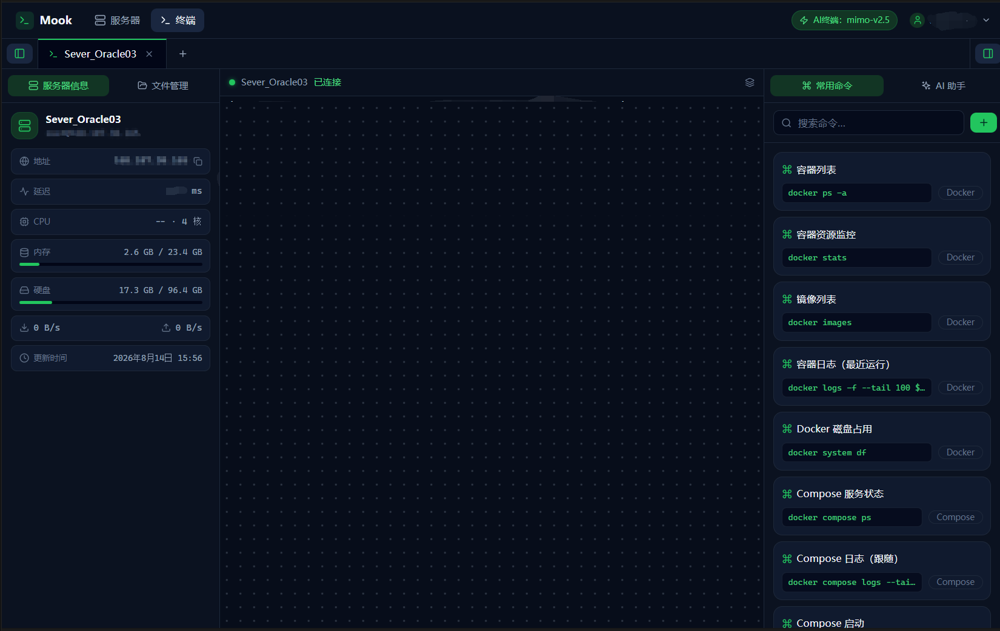

# 🗄️ Mook

<p align="center">
  
</p>

[](https://github.com/NikoYomi/mook)
[](#-license)
[](#-docker-%E9%83%A8%E7%BD%B2)
[](#-docker-%E9%83%A8%E7%BD%B2)

> **支持AI的自托管 SSH 终端与服务器管理工具。** 

---

## 📖 项目简介

Mook 是一个**自托管**的服务器运维工作台：把 Web SSH 终端、服务器监控、SFTP 文件管理和 AI 辅助融为一体，部署后只需一个网页入口即可集中管理所有 VPS。

- **一次部署，随处管理**：Docker 单容器启动，数据持久化（SQLite）
- **浏览器即终端**：基于 xterm.js 的 Web SSH，多标签并行会话、自动重连、原生复制粘贴
- **AI 写在骨子里**：对接 OpenAI 兼容接口，支持大模型辅助

**当前版本：v0.2.7** 

> 📖 **完整使用介绍**：[Mook —— 免费开源的自托管 AI 中端页面](https://blog.snty.de/archives/mookmian-fei-kai-yuan-de-aizhong-duan-ye-mian)

---

## 📸 项目截图

<p align="center">
  
</p>

---

## ✨ 核心功能

- 🔐 **单密码登录**：设置密码保护隐私。
- 🖥️ **Web SSH 终端**：xterm.js，多标签并行会话、断线检测与自动重连、回显行自动标绿、`Ctrl+Shift+C` 复制、背景纹理轮动与自定义上传
- 📊 **服务器监控面板**：实时延迟 / CPU / 内存 / 硬盘 使用率
- 📁 **SFTP 文件管理**：浏览 / 上传 / 下载 / 新建目录 / 重命名 / 删除
- 🏷️ **服务器管理**：支持增删改、密码 / 私钥认证、一键复制 IP、上次连接时间
- 🤖 **AI 助手**：OpenAI 兼容接口（DeepSeek / OpenAI / Gemini / Kimi / 智谱 / Ollama / 自定义厂商），自动获取模型
- 💾 **备份与还原**：一键导出 / 导入全部服务器、AI 设置与常用命令
- 🎨 **主题与多语言**：亮色 / 暗色 / 跟随系统三态主题，中 / 英界面切换
- 🐳 **单容器 Docker 部署**：端口 **5866**，数据持久化

---

## 🛠️ 技术栈

| 端     | 技术 |
| ------ | --- |
| 前端   | React 18 · TypeScript · Vite · Tailwind CSS 4 · xterm.js 5 · Zustand · react-router |
| 后端   | Go · 标准库 net/http · gorilla/websocket · golang.org/x/crypto（SSH）· pkg/sftp · modernc.org/sqlite（纯 Go 驱动） |
| 存储   | SQLite（单文件，随数据卷持久化） |
| 部署   | Docker 多阶段构建 · GitHub Actions 多平台镜像（amd64 / arm64）· GHCR / Docker Hub |

---

## 🐳 Docker 部署

### 前置要求

Docker 20.10+，支持 Linux / macOS / Windows（WSL2）。

### 方式一：使用发布镜像（推荐，免本机构建）

打 `v*` Tag 时由 GitHub Actions 自动构建并推送镜像（tag 含 `0.2.5` / `latest`，双平台）：

- **GHCR**：`ghcr.io/nikoyomi/mook`
- **Docker Hub**：`nikoyomi/mook`

新建 `docker-compose.yml`：

```yaml
services:
  mook:
    image: ghcr.io/nikoyomi/mook:latest   # 固定版本；升级时改为新版本号或 latest
    container_name: mook
    ports:
      - "5866:5866"        # 「宿主机端口 : 容器端口」
    volumes:
      - mook-data:/data    # 数据卷：SQLite 数据库与加密密钥均存于此
    environment:
      - MOOK_PORT=5866               # 与上方容器端口保持一致
      - MOOK_DATA=/data              # 数据目录（对应数据卷挂载点）
      # - MOOK_PASSWORD=你的密码      # 可选：预设初始管理员密码（不设则网页引导）
    restart: unless-stopped

volumes:
  mook-data:               # 具名数据卷，compose down 不会删除数据
```

### 方式二：本地源码构建

仓库自带 `docker/Dockerfile` 与 `docker/docker-compose.yml`（三段式构建），在项目 `docker/` 目录下：

```bash
docker compose up -d --build
```

访问 `http://localhost:5866`，首次进入会引导设置管理员密码。

### 常用命令

```bash
docker compose up -d                 # 启动
docker compose logs -f mook          # 查看日志
docker compose down                  # 停止（保留数据）
docker compose down -v               # 停止并删除数据卷（慎用）
docker compose pull && docker compose up -d   # 升级到新版本
```

> HTTPS：建议通过 Caddy / Nginx 反向代理启用，生产环境勿将 5866 直接暴露公网。

### 🌐 网络与构建源

默认使用 GitHub 官方 / 原生源构建，GitHub Actions 环境下无需任何镜像即可完成构建：

| 依赖 | 默认源 |
| --- | --- |
| Docker 基础镜像 | `docker.io/library` |
| Go 模块 | `https://proxy.golang.org,direct` |
| npm 包 | `https://registry.npmjs.org` |

国内网络环境下，可通过环境变量覆盖为国内源（`BASE_IMAGE` / `NPM_REGISTRY` / `GOPROXY` 三个构建参数，或 compose 的 `MOOK_REGISTRY` / `MOOK_NPM_REGISTRY` / `MOOK_GOPROXY`）：

```bash
MOOK_REGISTRY=<国内 Docker 镜像仓库>/library \
MOOK_NPM_REGISTRY=https://registry.npmmirror.com \
MOOK_GOPROXY=https://goproxy.cn,direct \
docker compose up -d --build
```

> `MOOK_REGISTRY` 只影响 Docker 基础镜像；Go 模块与 npm 分别由 `MOOK_GOPROXY`、`MOOK_NPM_REGISTRY` 控制。

---

## 💻 本地开发（免 Docker）

环境要求：Node 20+、Go 1.23+。

```bash
# 终端 1：后端（端口 5866）
cd backend
go mod tidy
MOOK_DATA=./data go run .        # 可另设 MOOK_DATA 指定数据目录

# 终端 2：前端（Vite 开发服务器，代理到 5866）
cd frontend
npm install
npm run dev
```

前端访问 `http://localhost:5173`（`npm run build` 即 `tsc --noEmit && vite build`）。

一键构建发布包：

```bash
./scripts/build.sh      # Linux / macOS
.\scripts\build.ps1     # Windows
```

构建后前端产物在 `frontend/dist`，后端单文件在 `backend/mook`（Windows 为 `mook.exe`）。

目录结构：

```text
mook/
├── backend/        # Go 后端（API / 认证 / SSH / WebSocket / SFTP / AI / SQLite）
│   ├── api/            # HTTP 路由与处理
│   ├── ssh/            # SSH 终端会话与 SFTP
│   ├── websocket/      # 终端 WebSocket 桥接
│   ├── ai/             # OpenAI 兼容 AI 调用
│   ├── auth/           # 登录 / 会话 / 限流
│   └── database/       # SQLite 持久化（含增量迁移）
├── frontend/       # React + TypeScript + Tailwind + xterm.js
├── docker/         # Dockerfile 与 docker-compose
├── docs/           # 文档（API 一览）
└── scripts/        # 构建脚本
```

---

## ⚙️ 环境配置

### 环境变量

| 变量 | 默认值 | 说明 |
| --- | --- | --- |
| `MOOK_PORT` | `5866` | HTTP 服务端口 |
| `MOOK_DATA` | `./data` | 数据目录（SQLite 与密钥） |
| `MOOK_DIST` | `./dist` | 前端静态资源目录 |
| `MOOK_PASSWORD` | 空 | 可选：预设初始管理员密码 |
| `MOOK_SECRET` | 自动生成 | 可选：凭据加密密钥 |

### 🤖 AI 配置

在「设置 → AI 助手」页填写（支持 DeepSeek、OpenAI、Gemini、Kimi、智谱、Ollama 及自定义厂商）：

- **选择厂商**：下拉选择，或选「自定义」填写厂商名与接口地址
- **API Key**：填写后自动获取该密钥支持的模型
- **模型**：下拉选择获取到的模型，或切换为手动输入

未配置 API Key 时 AI 功能不可用，不影响 SSH 使用。

### 🔒 安全说明

- 密码使用 bcrypt 哈希；SSH 密码、私钥、AI Key 均加密存储
- 登录限流：5 次失败锁定 15 分钟（重启容器可重置）；会话有效期 6 小时
- 建议通过 Caddy / Nginx 反向代理启用 HTTPS
- v0.2.x 暂不校验 SSH 主机指纹（known_hosts），后续版本完善

---

## 🗺️ 开发路线

- ✅ v0.1 —— 基础 SSH 终端 + AI 助手
- ✅ v0.2 —— 监控面板 + SFTP 文件管理 + 多标签会话 + AI 自动获取模型 + CI/CD 发布
- ✅ v0.2.1 —— 主题系统 / 中英双语 / 终端体验与监控采集打磨
- ✅ v0.2.2 —— 服务器拖拽排序 / 常用命令使用计数与置顶 / 请求日志
- ✅ v0.2.3 —— Docker Hub 双源发布 / 按钮提示 / 终端页脚与内边距
- ✅ v0.2.4 —— 登录页品牌 / 下拉宽度修正 / 新增终端背景
- ✅ v0.2.7 —— Mook 助手提示词升级 / 命令精准提取 / 断开自动清空 AI 输出（当前）
- ✅ v0.2.6 —— 备份跨环境还原修复（凭据随备份重加密）/ 提示改悬浮 Toast
- ⏳ v0.5 —— 文件管理增强 + Docker 可视化管理（容器列表 / 启停 / 日志 / Shell）
- ⏳ v1.0 —— Agent + Relay 中转同步
- ⏳ v2.0 —— AI DevOps 助手

---

## 📄 更新日志

### v0.2.7

- **AI 助手提示词升级**：AI 分析改用全新的 Mook 助手提示词，内置闲聊 / 知识解释 / 操作指导 / 故障排查 / 日志分析五类模式判断与通用规则，回答更贴合用户意图
- **命令精准提取**：「发送到终端」只发送 AI 给出的真实可执行命令——优先提取命令代码块，自动去除 `$`/`#` 提示符、注释与说明文字；无命令时按钮自动隐藏
- **断开自动清空**：SSH 连接断开 / 失败时自动清空右侧 AI 面板的输出，避免残留上一次分析结果

### v0.2.6

- **备份还原修复**：修复还原备份后服务器密码 / AI 密钥丢失的问题——备份导出时凭据解密为明文放入加密包，还原时用当前服务端密钥重新加密，备份可在任意环境 / 任意密钥下还原
- **提示改悬浮 Toast**：登录错误、SSH 连接失败、服务器保存 / 删除 / 排序、设置保存等所有内联提示统一改为顶部悬浮 Toast（2 秒自动消失），不再占用布局空间
- **弹窗框选保护规范化**：提取共享 `isDragSelectingInside()`，所有含输入框的弹窗遮罩关闭带框选保护，避免选中文字拖出误关弹窗

### v0.2.5

- **AI 密钥按厂商隔离**：每个厂商（base_url）独立加密存储密钥，切换厂商不再互相覆盖；设置页切换厂商时实时显示各厂商密钥配置状态
- **备份口令加密**：备份导出改为整包密码加密（PBKDF2 + AES-256-GCM），导出/导入增加密码确认；兼容导入旧版明文备份
- **终端背景更新**：新增「层叠山峦」「电路板」两款背景，替换原「矩阵雨」「扫描线」
- **聚焦样式细化**：输入框聚焦绿色描边 / 光环从 2px 改 1px、颜色更淡

### v0.2.1

- **主题系统**：亮色 / 暗色 / 跟随系统三态切换（Apple 极简多级白色阶、柔和阴影、首屏防闪烁）
- **界面语言**：中 / 英切换（覆盖主要按钮与导航）
- **设置页重构**：新增「通用设置」Tab（账户安全 / 外观 / 终端背景）；「备份与还原」更名「数据管理」，导出 / 导入按钮加大
- **终端体验**：回显行可靠标绿、`Ctrl/Cmd+Shift+C` 复制选中内容、背景纹理轮动与上传自定义背景、点击常用命令后焦点回到终端
- **常用命令**：默认改为 Docker / docker-compose 常用命令（旧数据自动迁移）
- **服务器监控**：移除网络速度监控（高延迟下恒为 0，无实际价值）；采集脚本移除 `awk` 依赖（兼容 Oracle 云 arm64 等精简系统）；轮询改为串行 3 秒，避免高延迟下请求重叠响应乱序
- **会话与安全**：登录会话有效期调整为 6 小时；登录改为纯密码模式（不再区分用户名）
- **UI 细节**：空状态小窗口溢出修复、语义色彩 token 统一、下拉菜单与账户按钮同宽、Servers 页页脚

### v0.2.0

- 服务器信息面板：实时延迟 / CPU / 内存 / 硬盘 / 上下行速率，2 秒轮询
- SFTP 文件管理：浏览 / 上传 / 下载 / 新建 / 重命名 / 删除
- 多标签 SSH 终端：切换标签保留会话与历史输出
- 服务器「上次连接」时间展示
- AI 设置重构：厂商下拉 / API Key 自动获取模型 / 获取成功才显示保存
- 终端输出着色：错误行红色、提示符 / 用户输入行绿色；无换行提示符立即可见
- 服务器卡片网格最多 5 列；设置弹窗多轮布局与交互优化
- CI/CD：GitHub Actions 自动构建 GHCR / Docker Hub 镜像并创建 Release

### v0.1.0

- 单密码登录（首次运行引导）
- Web SSH 终端（xterm.js）
- 服务器管理（增删改、密码 / 私钥认证）
- AI 助手（OpenAI 兼容接口，命令生成、日志分析）
- 备份与还原
- 单容器 Docker 部署

---

## 📄 License

[MIT](LICENSE) © 2026 NikoYomi

---

## 📚 文档

- [完整使用介绍（博客）](https://blog.snty.de/archives/mookmian-fei-kai-yuan-de-aizhong-duan-ye-mian)
- [API 一览](docs/API.md)
- 开发变更记录保存在本地工作区「计划」文件夹（不随仓库发布）