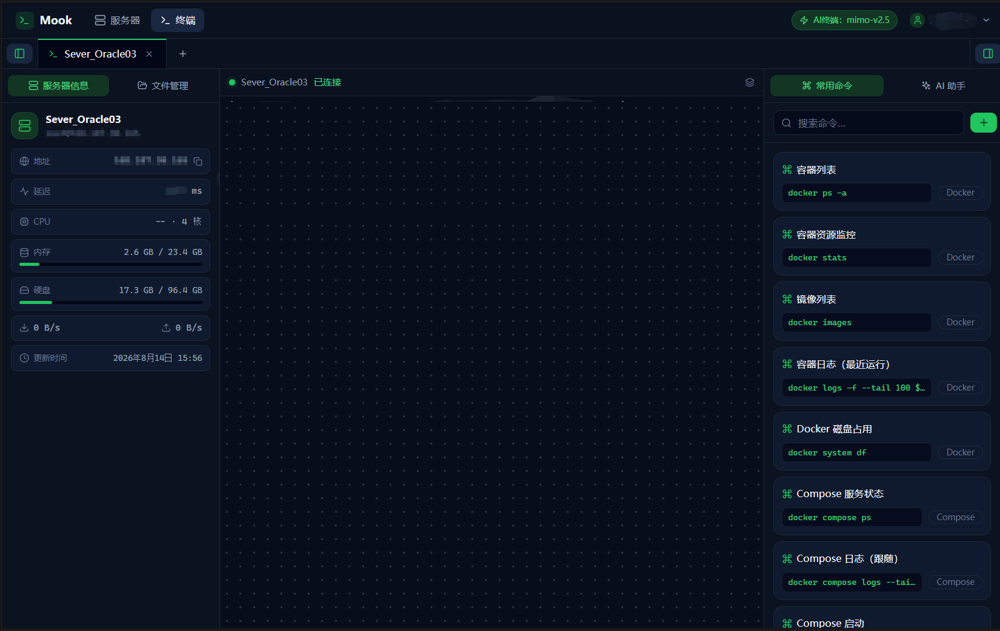

# 🗄️ Mook

<p align="center">
  
</p>

[](https://github.com/NikoYomi/mook)
[](#-license)
[](#-docker-%E9%83%A8%E7%BD%B2)
[](#-docker-%E9%83%A8%E7%BD%B2)

> **支持AI的自托管 SSH 终端与服务器管理工具。** 

---

## 📖 项目简介

Mook 是一个**自托管**的服务器运维工作台：把 Web SSH 终端、服务器监控、SFTP 文件管理和 AI 辅助融为一体，部署后只需一个网页入口即可集中管理所有 VPS。

- **一次部署，随处管理**：Docker 单容器启动，数据持久化（SQLite）
- **浏览器即终端**：基于 xterm.js 的 Web SSH，多标签并行会话、自动重连、原生复制粘贴
- **AI 写在骨子里**：对接 OpenAI 兼容接口，支持大模型辅助

**当前版本：v0.4.6** 

> 📖 **完整使用介绍**：[Mook —— 免费开源的自托管 AI 中端页面](https://blog.snty.de/archives/mookmian-fei-kai-yuan-de-aizhong-duan-ye-mian)

---

## 📸 项目截图

<p align="center">
  
</p>

---

## ✨ 核心功能

- 🔐 **单密码登录**：设置密码保护隐私。
- 🖥️ **Web SSH 终端**：xterm.js，多标签并行会话、断线检测与自动重连、回显行自动标绿、`Ctrl+Shift+C` 复制、背景纹理轮动与自定义上传
- 📊 **服务器监控面板**：实时延迟 / CPU / 内存 / 硬盘 使用率
- 📁 **SFTP 文件管理**：浏览 / 上传 / 下载 / 新建目录 / 重命名 / 删除
- 🏷️ **服务器管理**：支持增删改、密码 / 私钥认证、一键复制 IP、上次连接时间
- 🤖 **AI 助手**：OpenAI 兼容接口（DeepSeek / OpenAI / Gemini / Kimi / 智谱 / Ollama / 自定义厂商），自动获取模型
- 💾 **备份与还原**：一键导出 / 导入全部服务器、AI 设置与常用命令
- 🎨 **主题与多语言**：亮色 / 暗色 / 跟随系统三态主题，中 / 英界面切换
- 🔑 **访问密钥 + Agent 接口**：创建带权限范围的 API Key，让外部 Agent 通过 `/api/agent/*` 管理服务器、执行命令、读写文件、编辑常用命令
- 🐳 **单容器 Docker 部署**：端口 **5866**，数据持久化

---

## 🛠️ 技术栈

| 端     | 技术 |
| ------ | --- |
| 前端   | React 18 · TypeScript · Vite · Tailwind CSS 4 · xterm.js 5 · Zustand · react-router |
| 后端   | Go · 标准库 net/http · gorilla/websocket · golang.org/x/crypto（SSH）· pkg/sftp · modernc.org/sqlite（纯 Go 驱动） |
| 存储   | SQLite（单文件，随数据卷持久化） |
| 部署   | Docker 多阶段构建 · GitHub Actions 多平台镜像（amd64 / arm64）· GHCR / Docker Hub |

---

## 🐳 Docker 部署

### 前置要求

Docker 20.10+，支持 Linux / macOS / Windows（WSL2）。

### 方式一：使用发布镜像（推荐，免本机构建）

打 `v*` Tag 时由 GitHub Actions 自动构建并推送镜像（tag 含完整版本号、`主版本.次版本`、`latest` 与提交短 SHA，双平台 amd64/arm64）：

- **GHCR**：`ghcr.io/nikoyomi/mook`
- **Docker Hub**：`nikoyomi/mook`

新建 `docker-compose.yml`：

```yaml
services:
  mook:
    image: ghcr.io/nikoyomi/mook:latest   # 固定版本；升级时改为新版本号或 latest
    container_name: mook
    ports:
      - "5866:5866"        # 「宿主机端口 : 容器端口」
    volumes:
      - mook-data:/data    # 数据卷：SQLite 数据库与加密密钥均存于此
    environment:
      - MOOK_PORT=5866               # 与上方容器端口保持一致
      - MOOK_DATA=/data              # 数据目录（对应数据卷挂载点）
      # - MOOK_PASSWORD=你的密码      # 可选：预设初始管理员密码（不设则网页引导）
    restart: unless-stopped

volumes:
  mook-data:               # 具名数据卷，compose down 不会删除数据
```

### 方式二：本地源码构建

仓库自带 `docker/Dockerfile` 与 `docker/docker-compose.yml`（三段式构建），在项目 `docker/` 目录下：

```bash
docker compose up -d --build
```

访问 `http://localhost:5866`，首次进入会引导设置管理员密码。

### 常用命令

```bash
docker compose up -d                 # 启动
docker compose logs -f mook          # 查看日志
docker compose down                  # 停止（保留数据）
docker compose down -v               # 停止并删除数据卷（慎用）
docker compose pull && docker compose up -d   # 升级到新版本
```

> HTTPS：建议通过 Caddy / Nginx 反向代理启用，生产环境勿将 5866 直接暴露公网。

### 🌐 网络与构建源

默认使用 GitHub 官方 / 原生源构建，GitHub Actions 环境下无需任何镜像即可完成构建：

| 依赖 | 默认源 |
| --- | --- |
| Docker 基础镜像 | `docker.io/library` |
| Go 模块 | `https://proxy.golang.org,direct` |
| npm 包 | `https://registry.npmjs.org` |

国内网络环境下，可通过环境变量覆盖为国内源（`BASE_IMAGE` / `NPM_REGISTRY` / `GOPROXY` 三个构建参数，或 compose 的 `MOOK_REGISTRY` / `MOOK_NPM_REGISTRY` / `MOOK_GOPROXY`）：

```bash
MOOK_REGISTRY=<国内 Docker 镜像仓库>/library \
MOOK_NPM_REGISTRY=https://registry.npmmirror.com \
MOOK_GOPROXY=https://goproxy.cn,direct \
docker compose up -d --build
```

> `MOOK_REGISTRY` 只影响 Docker 基础镜像；Go 模块与 npm 分别由 `MOOK_GOPROXY`、`MOOK_NPM_REGISTRY` 控制。

---

## 💻 本地开发（免 Docker）

环境要求：Node 20+、Go 1.23+。

```bash
# 终端 1：后端（端口 5866）
cd backend
go mod tidy
MOOK_DATA=./data go run .        # 可另设 MOOK_DATA 指定数据目录

# 终端 2：前端（Vite 开发服务器，代理到 5866）
cd frontend
npm install
npm run dev
```

前端访问 `http://localhost:5173`（`npm run build` 即 `tsc --noEmit && vite build`）。

一键构建发布包：

```bash
./scripts/build.sh      # Linux / macOS
.\scripts\build.ps1     # Windows
```

构建后前端产物在 `frontend/dist`，后端单文件在 `backend/mook`（Windows 为 `mook.exe`）。

目录结构：

```text
mook/
├── backend/        # Go 后端（API / 认证 / SSH / WebSocket / SFTP / AI / SQLite）
│   ├── api/            # HTTP 路由与处理
│   ├── ssh/            # SSH 终端会话与 SFTP
│   ├── websocket/      # 终端 WebSocket 桥接
│   ├── ai/             # OpenAI 兼容 AI 调用
│   ├── auth/           # 登录 / 会话 / 限流
│   └── database/       # SQLite 持久化（含增量迁移）
├── frontend/       # React + TypeScript + Tailwind + xterm.js
├── docker/         # Dockerfile 与 docker-compose
├── docs/           # 文档（API 一览）
└── scripts/        # 构建脚本
```

---

## ⚙️ 环境配置

### 环境变量

| 变量 | 默认值 | 说明 |
| --- | --- | --- |
| `MOOK_PORT` | `5866` | HTTP 服务端口 |
| `MOOK_DATA` | `./data` | 数据目录（SQLite 与密钥） |
| `MOOK_DIST` | `./dist` | 前端静态资源目录 |
| `MOOK_PASSWORD` | 空 | 可选：预设初始管理员密码（至少 8 位） |
| `MOOK_SECRET` | 自动生成 | 可选：凭据加密密钥 |
| `MOOK_TRUST_PROXY` | 空 | 可选：置 `1` 时采信 `X-Forwarded-For`。**仅在应用前面确实有可信反向代理时开启**，否则该头可被伪造，按 IP 的登录限流会被绕过 |

### 🤖 AI 配置

在「设置 → AI 助手」页填写（支持 DeepSeek、OpenAI、Gemini、Kimi、智谱、Ollama 及自定义厂商）：

- **选择厂商**：下拉选择，或选「自定义」填写厂商名与接口地址
- **API Key**：填写后自动获取该密钥支持的模型
- **模型**：下拉选择获取到的模型，或切换为手动输入

未配置 API Key 时 AI 功能不可用，不影响 SSH 使用。

### 🔒 安全说明

- 密码使用 bcrypt 哈希；SSH 密码、私钥、AI Key 均加密存储
- 登录限流：5 次失败锁定 15 分钟（重启容器可重置）；会话有效期 6 小时
- 建议通过 Caddy / Nginx 反向代理启用 HTTPS
- 当前版本暂不校验 SSH 主机指纹（known_hosts），后续版本完善

---

## 🔌 Mook 插件（外部 Agent 接入）

Mook 可以把托管能力交给外部 Agent —— 在 **设置 → 访问密钥** 创建一个带权限范围的密钥，
Agent 就能通过 `/api/agent/*` 管理服务器、执行命令、读写文件、编辑常用命令。

配套插件 **[dsh-mook-skill](https://github.com/NikoYomi/dsh-mook-skill)** 让
**DeepSeek Harness** 的 Agent 开箱即用（含技能文档 + MCP 服务器，14 个工具）：

```bash
git clone https://github.com/NikoYomi/dsh-mook-skill.git
cd dsh-mook-skill
./install.sh                        # 安装技能到 DSH 技能根
```

然后在 Mook 里建密钥，并配置两个环境变量：

```bash
export MOOK_URL=http://你的地址:5866    # 不要尾斜杠
export MOOK_API_KEY=mk_你的密钥
```

| 需要的密钥权限 | 能做什么 |
| --- | --- |
| `servers:read` / `commands:read` | 查看服务器与常用命令（**新建密钥默认只有这两项**） |
| `commands:write` | 增删改常用命令 |
| `servers:write` | 增删改服务器 |
| `servers:exec` | ⚠️ 远程执行命令、读写文件 —— 等于交出 shell，默认不勾选 |

> 技能与 MCP 的详细安装、接口字段、排错见插件仓库的 README 与 `skills/mook/`。
> 账户与备份接口**刻意不对外开放**，Agent 只能操作服务器与常用命令。

---

## 🗺️ 开发路线

- ✅ v0.1 —— 基础 SSH 终端 + AI 助手
- ✅ v0.2 —— 监控面板 + SFTP 文件管理 + 多标签会话 + AI 自动获取模型 + CI/CD 发布
- ✅ v0.2.1 —— 主题系统 / 中英双语 / 终端体验与监控采集打磨
- ✅ v0.2.2 —— 服务器拖拽排序 / 常用命令使用计数与置顶 / 请求日志
- ✅ v0.2.3 —— Docker Hub 双源发布 / 按钮提示 / 终端页脚与内边距
- ✅ v0.2.4 —— 登录页品牌 / 下拉宽度修正 / 新增终端背景
- ✅ v0.2.7 —— Mook 助手提示词升级 / 命令精准提取 / 断开自动清空 AI 输出
- ✅ v0.2.8 —— AI 对话按标签隔离 / 服务器延迟与信息修复 / AI 富文本输出与命令块发送 / 新增厂商
- ✅ v0.2.9 —— 飞牛 fnOS 应用包（.fpk）+ 统一网关接入 + 多平台 Release 产物
- ✅ v0.2.6 —— 备份跨环境还原修复（凭据随备份重加密）/ 提示改悬浮 Toast
- ✅ v0.3.0 —— 发布产物精简为 3 个并统一命名 / Windows 真安装程序 / 终端选中即复制与双击粘贴
- ✅ v0.3.1 —— 安全修复：登录限流恢复生效 / 限流内存回收 / 可信代理开关 / 口令下限与 Cookie 加固
- ✅ v0.4.0 —— 访问密钥（API Key）+ Agent 接口 + MCP 服务器，外部 Agent 可接入管理服务器与常用命令
- ✅ v0.4.3 —— 飞牛 fnOS 套件版开放宿主机端口（安装向导选端口），外部 Agent / 插件可直连
- ✅ v0.4.5 —— 修复套件版直连端口 404：TCP 侧同时接受带前缀与不带前缀的路径
- ✅ v0.4.6 —— 访问密钥弹窗的 MOOK_URL 改用实际访问地址，不再写死 5866（当前）
- ⏳ v0.5 —— 文件管理增强 + Docker 可视化管理（容器列表 / 启停 / 日志 / Shell）
- ⏳ v1.0 —— Agent + Relay 中转同步
- ⏳ v2.0 —— AI DevOps 助手

---

## 📄 更新日志

### v0.4.0

> 本次新增**外部 Agent 接入能力**：Agent 通过访问密钥调用 Mook，管理托管的服务器与常用命令。

- **访问密钥（API Key）**：设置页新增「访问密钥」标签，可创建 / 撤销 / 删除密钥，按权限（scope）与有效期精细授权
  - 密钥格式 `mk_` + 48 位随机十六进制，服务端只存 SHA-256 摘要，**明文仅创建时显示一次**
  - 五项权限：`servers:read` / `servers:write` / `servers:exec` / `commands:read` / `commands:write`，亦支持 `*`
- **Agent 接口 `/api/agent/*`**：14 个接口覆盖服务器增删改查与实时状态、远程命令执行、SFTP 读写文件、常用命令增删改查
  - 鉴权支持 `Authorization: Bearer <key>` 与 `X-API-Key: <key>`
  - 远程执行默认超时 60 秒、上限 600 秒；读文件上限 1 MiB
  - 面向浏览器会话的接口与密钥鉴权**并存但隔离**，账户改密与备份导出等高风险操作**不对外开放**
- **MCP 服务器**：仓库新增 `mcp/` 目录，开箱即用的 MCP 服务器把上述接口封装成 14 个工具，配置 `MOOK_URL` 与 `MOOK_API_KEY` 即可接入
- **配套插件 [dsh-mook-skill](https://github.com/NikoYomi/dsh-mook-skill)**：面向 DeepSeek Harness 的技能文档 + MCP 打包，`git clone` 后 `./install.sh` 一步装好（独立仓库维护）
- **常用命令支持单条增删改**：后端新增按 id 的读取 / 新增 / 更新 / 删除，Agent 改一条命令不再需要重写整份列表（前端原有的全量保存路径保持不变）
- 访问日志新增 `[agent]` 记录，**只记密钥 id、方法、路径与状态码**，不记录命令内容、主机与文件路径

### v0.3.1

> 本次为**安全修复**，建议所有用户升级。

- **修复登录限流完全失效**：此前连续输错密码**不会触发锁定**（README 承诺的「5 次失败锁定 15 分钟」实际从未生效）。现已修复，连续失败 5 次后第 6 次会被拒绝（429）
- **修复限流内存无回收 + 代理头可伪造**：`X-Forwarded-For` 此前被**无条件信任**，攻击者每次伪造不同 IP 即可绕过限流、并使服务内存无上限增长。现默认**不采信**该请求头，只使用直连地址；新增环境变量 `MOOK_TRUST_PROXY`，**确认前面有可信反向代理时**再开启
- **修复首次初始化并发竞态**：`/api/setup` 的「检查是否已初始化」与「创建用户」改为同一事务，避免并发请求重复初始化
- **加固会话 Cookie**：经 HTTPS 访问时自动为会话 Cookie 加上 `Secure` 标志（纯 HTTP 的局域网部署不受影响）；退出登录的删除指令同步使用相同取值，确保退出真正生效
- **口令下限 6 位 → 8 位**：该账号可访问全部服务器凭据，加密备份内亦含明文凭据。适用范围：首次初始化、修改密码、导出加密备份、`MOOK_PASSWORD` 预设值（短于下限将拒绝启动）。**还原备份不设下限**，历史备份不受影响
- **修复 `docker/docker-compose.yml` 镜像名与版本**：此前为 `mook/mook:0.2.5`（命名空间错误，照此文件拉取必然失败），现为 `nikoyomi/mook:0.3.1`
- 修正 README 中两处过时的版本描述

### v0.3.0

- **发布产物精简为 3 个**：只保留 Windows、macOS（M 系列芯片）、飞牛 fnOS 三个安装包，命名统一为 `mook-版本号-系统-机型`；Release 页面不再出现中间产物
  - `mook-v0.3.0-windows-x64.exe`
  - `mook-v0.3.0-macos-arm64.tar.gz`
  - `mook-v0.3.0-fnos-x86-arm.fpk`
- **Windows 改为真正的安装程序**：不再是压缩包，而是 Inno Setup 安装向导 —— 可选安装目录、创建桌面快捷方式、设置开机自启，并自带卸载程序；默认按「仅当前用户」安装，无需管理员权限
- **终端选中即复制**：在终端里框选文字后，选区右上角会浮出一个复制按钮，点一下即可复制；点击别处或重新框选时按钮自动消失
- **终端双击粘贴**：在终端界面双击即可把剪贴板内容粘贴进去（`Shift+V` 同样可用）；剪贴板读取受浏览器安全策略限制，非 HTTPS / localhost 环境会给出提示
- **界面精简**：移除主页左上角的图标与「Mook」名称，导航更紧凑
- **macOS 首次运行提示**：安装包未做代码签名，若提示「无法验证开发者」，请右键 →「打开」，或执行 `xattr -dr com.apple.quarantine ./mook`

### v0.4.6

- **修复创建访问密钥弹窗里的 `MOOK_URL` 写死 5866 的问题**
  - 弹窗给出的 MCP 配置片段此前固定输出 `MOOK_URL=http://<你的-Mook-地址>:5866`。
    但 5866 只是**容器内**的默认监听端口，并非用户实际访问的地址：
    飞牛套件版端口由安装向导决定（v0.4.3 起可自选），独立 Docker 部署的宿主端口也可任意映射。
    照抄这段配置必然连不上
  - 修法：改为按当前页面地址生成 —— `window.location.origin + BASE_PATH`。
    `BASE_PATH` 即后端注入的 `<base href>` 去掉尾斜杠，因此
    独立部署得到 `http://<host>:<端口>`，飞牛网关部署得到 `http://<host>:<端口>/app/mook`，
    两种形态都拿到实际可用的地址
  - 同时补充说明：若 MCP 客户端运行在另一台机器上，需把主机名换成该机器能访问到的地址

### v0.4.5

- **修复飞牛套件版直连端口上 `/api/*` 全部 404 的问题**
  - 根因：`stripBasePath` 把**不带 `MOOK_BASE_PATH` 前缀**的路径一律 404。套件版必须设
    `MOOK_BASE_PATH=/app/mook`（统一网关需要），于是直连端口的 `/api/agent/*` 全不可达，
    插件只能看到 `404 page not found`，报「Mook 没有返回 JSON」
  - 修法：TCP 与 Unix Socket 两个监听口采用**不同**的前缀策略 —— Socket（网关侧）
    仍严守前缀，TCP（直连侧）同时接受带前缀与不带前缀两种路径
  - 安全性不变：前缀剥离不构成鉴权，每个 `/api/*` 仍各自要求会话 Cookie 或 API 密钥
- **修复直连端口上前端资源取不到的问题**
  - `<base href>` 改为跟随本次请求实际所在的路径：网关请求注入 `/app/mook/`，
    直连请求注入 `/`（上游在剥离前缀前打 context 标记，因为剥离后就认不出原前缀）

### v0.4.3

- **飞牛 fnOS 应用包端口改为安装向导选择**（修复 v0.4.2 套件版装完仍是旧版、插件连不上的问题）
  - v0.4.2 误用了 `${TRIM_SERVICE_PORT}` 并配 `checkport=true`，但既无 `service_port` 也无 `wizard/`，飞牛没有端口可校验，配置流程走不完
  - 现改为官方标准形态：`manifest` 声明 `service_port=5866` + `checkport=false`，新增 `wizard/install` 在**安装向导里让用户选端口**（默认 5866），compose 用 `"${mook_web_port:-5866}:5866"`
  - 新增 `wizard/config`，装完后可在应用设置里随时改端口，无需卸载重装
  - **装完即可用**：端口自动生效，不需要用户做任何额外操作
- **飞牛 fnOS 应用包支持外部 Agent 直连**：容器除供网关使用的 Unix Socket 外，**同时发布宿主机端口**，外部程序可通过 `http://<NAS>:<端口>` 直连
  - 后端 TCP 与 Socket 监听本就并存（`backend/main.go`），补齐端口映射即可，两种访问方式互不影响
  - 直连端口走 Mook 自己的登录与访问密钥体系，不经过飞牛登录态，与独立 Docker 部署一致
  - 应用中心主图标仍走网关（iframe + 登录态），另注册一个隐藏入口 `mook.direct` 承载直连地址
- **修复套件版升级后容器不重建**：`cmd/upgrade_callback` 此前只 `docker pull`，而 compose 变更（端口映射、镜像标签）不会让既有容器换用新配置 —— 表现为「应用中心显示新版，容器里跑的仍是旧版」。现在升级时显式 `up -d --force-recreate`，用户数据卷不受影响

### v0.2.9

- **飞牛 fnOS 应用包**：新增 `fnos/` 打包目录，可构建 `.fpk` 安装包，支持在飞牛 fnOS 应用中心安装使用（`platform=all`，单包同时适配 x86 与 ARM）
- **统一网关接入**：支持通过 fnOS 统一网关访问（复用系统访问域名、接入 NAS 登录态、免端口冲突），HTTP 与 WebSocket 均经网关转发
- **子路径部署能力**：同一份前端构建产物既能在根路径运行，也能部署在 `/app/mook` 等子路径下；后端可额外监听 Unix Socket（`MOOK_SOCKET`），并按 `MOOK_BASE_PATH` 剥离访问前缀
- **多平台发布**：打标签时自动构建 Windows / macOS（arm64 + amd64）/ Linux（amd64 + arm64）可执行文件与 fnOS 应用包，统一挂到 GitHub Release
- **兼容性**：自建 Docker 部署**不受影响** —— 新增能力均为可选，`docker/docker-compose.yml` 未做改动

### v0.2.8

- **AI 对话按终端标签隔离**：每个终端标签拥有独立 AI 对话，切换标签时 AI 面板跟随显示当前标签自己的对话；关闭标签 / 连接断开时删除其对话，修复多标签并发分析互相覆盖导致的输出断流 / 不完整 / 格式错乱
- **服务器延迟与信息修复**：延迟改为命令执行完成后测量（真实往返，不再恒为 0）；切换标签时服务器信息按服务器缓存立即显示，不再跳动 / 闪空
- **AI 设置模型下拉修复**：切换厂商 / 获取模型列表后不再残留上一个厂商的模型
- **AI 输出富文本渲染**：markdown 符号不再裸显示；命令代码块高亮为可点击卡片，**点击即发送到终端**（可自主选择要发送的命令）；移除「发送到终端」与「复制结果」按钮
- **AI 输出 / 发送健壮性**：连接未就绪时不再误报「已发送」，命令排队连接建立后自动补发
- **终端滚动条优化**：隐藏 xterm 原生滚动条，内容多时不再遮挡终端输出
- **新增内置 AI 厂商**：小米 Mimo、通义千问；顶部「AI终端」标题支持显示 Mimo
- **AI 助手面板标题精简**：仅保留「Mook AI助手」
- **发送到终端识别更准**：提示词限定整个回答最多一个命令代码块并放末尾；`extractCommand` 优先取末尾命令块
- 服务器信息轮询 3s → 1s（后端 per-server SSH 连接池复用）

### v0.2.7

- **AI 助手提示词升级**：AI 分析改用全新的 Mook 助手提示词，内置闲聊 / 知识解释 / 操作指导 / 故障排查 / 日志分析五类模式判断与通用规则，回答更贴合用户意图
- **命令精准提取**：「发送到终端」只发送 AI 给出的真实可执行命令——优先提取命令代码块，自动去除 `$`/`#` 提示符、注释与说明文字；无命令时按钮自动隐藏
- **断开自动清空**：SSH 连接断开 / 失败时自动清空右侧 AI 面板的输出，避免残留上一次分析结果

### v0.2.6

- **备份还原修复**：修复还原备份后服务器密码 / AI 密钥丢失的问题——备份导出时凭据解密为明文放入加密包，还原时用当前服务端密钥重新加密，备份可在任意环境 / 任意密钥下还原
- **提示改悬浮 Toast**：登录错误、SSH 连接失败、服务器保存 / 删除 / 排序、设置保存等所有内联提示统一改为顶部悬浮 Toast（2 秒自动消失），不再占用布局空间
- **弹窗框选保护规范化**：提取共享 `isDragSelectingInside()`，所有含输入框的弹窗遮罩关闭带框选保护，避免选中文字拖出误关弹窗

### v0.2.5

- **AI 密钥按厂商隔离**：每个厂商（base_url）独立加密存储密钥，切换厂商不再互相覆盖；设置页切换厂商时实时显示各厂商密钥配置状态
- **备份口令加密**：备份导出改为整包密码加密（PBKDF2 + AES-256-GCM），导出/导入增加密码确认；兼容导入旧版明文备份
- **终端背景更新**：新增「层叠山峦」「电路板」两款背景，替换原「矩阵雨」「扫描线」
- **聚焦样式细化**：输入框聚焦绿色描边 / 光环从 2px 改 1px、颜色更淡

### v0.2.1

- **主题系统**：亮色 / 暗色 / 跟随系统三态切换（Apple 极简多级白色阶、柔和阴影、首屏防闪烁）
- **界面语言**：中 / 英切换（覆盖主要按钮与导航）
- **设置页重构**：新增「通用设置」Tab（账户安全 / 外观 / 终端背景）；「备份与还原」更名「数据管理」，导出 / 导入按钮加大
- **终端体验**：回显行可靠标绿、`Ctrl/Cmd+Shift+C` 复制选中内容、背景纹理轮动与上传自定义背景、点击常用命令后焦点回到终端
- **常用命令**：默认改为 Docker / docker-compose 常用命令（旧数据自动迁移）
- **服务器监控**：移除网络速度监控（高延迟下恒为 0，无实际价值）；采集脚本移除 `awk` 依赖（兼容 Oracle 云 arm64 等精简系统）；轮询改为串行 3 秒，避免高延迟下请求重叠响应乱序
- **会话与安全**：登录会话有效期调整为 6 小时；登录改为纯密码模式（不再区分用户名）
- **UI 细节**：空状态小窗口溢出修复、语义色彩 token 统一、下拉菜单与账户按钮同宽、Servers 页页脚

### v0.2.0

- 服务器信息面板：实时延迟 / CPU / 内存 / 硬盘 / 上下行速率，2 秒轮询
- SFTP 文件管理：浏览 / 上传 / 下载 / 新建 / 重命名 / 删除
- 多标签 SSH 终端：切换标签保留会话与历史输出
- 服务器「上次连接」时间展示
- AI 设置重构：厂商下拉 / API Key 自动获取模型 / 获取成功才显示保存
- 终端输出着色：错误行红色、提示符 / 用户输入行绿色；无换行提示符立即可见
- 服务器卡片网格最多 5 列；设置弹窗多轮布局与交互优化
- CI/CD：GitHub Actions 自动构建 GHCR / Docker Hub 镜像并创建 Release

### v0.1.0

- 单密码登录（首次运行引导）
- Web SSH 终端（xterm.js）
- 服务器管理（增删改、密码 / 私钥认证）
- AI 助手（OpenAI 兼容接口，命令生成、日志分析）
- 备份与还原
- 单容器 Docker 部署

---

## 📄 License

[MIT](LICENSE) © 2026 NikoYomi

---

## 🤝 开发 / 贡献指南

欢迎贡献！请先阅读 `计划/AI开发规范.md` 了解项目约定。

**快速开始**：
1. Fork 本仓库
2. 克隆到本地：`git clone https://github.com/你的用户名/mook.git`
3. 按照「本地开发」部分启动前后端
4. 创建功能分支：`git checkout -b feature/your-feature`
5. 提交更改：`git commit -m "feat: add your feature"`
6. 推送分支：`git push origin feature/your-feature`
7. 创建 Pull Request

**注意事项**：
- 测试文件请放入 `测试环境/` 目录，不要放入 `项目/mook/`
- 所有修改记录请写入 `计划/每日日志/` 目录
- 推送前请确保代码可通过 `go build` 和 `tsc --noEmit` 检查

---

## 📚 文档

- [完整使用介绍（博客）](https://blog.snty.de/archives/mookmian-fei-kai-yuan-de-aizhong-duan-ye-mian)
- [API 一览](docs/API.md)
- [MCP 服务器（外部 Agent 接入）](mcp/README.md)
- [插件 dsh-mook-skill（DeepSeek Harness 技能 + MCP）](https://github.com/NikoYomi/dsh-mook-skill)
- 开发变更记录保存在本地工作区「计划」文件夹（不随仓库发布）